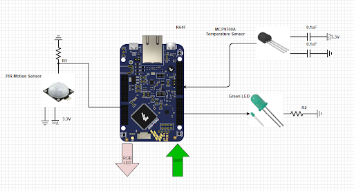
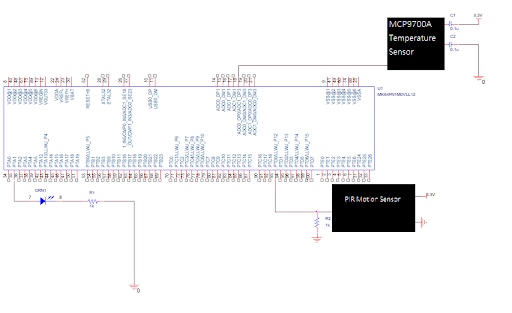

# Smart Fan Control

A temperature- and motion-responsive fan controller developed as a final project for the EE128 Embedded Systems course (Fall 2021).

This project uses a PWM signal from a K64F microcontroller to modulate fan speed based on ambient temperature, and includes a power-saving feature using a motion detector.

> **Note**: This project is no longer actively maintained or runnable due to lack of hardware. This repo serves as a portfolio reference.

---

## Features
- Automatic Fan Control via ADC temperature sensor
- Manual Mode Switching using onboard switch (auto, speed 1–3)
- Power-Saving Mode: Turns off PWM after inactivity using PIR sensor
- 25kHz PWM Output adjustable based on temperature
- Visual Debugging: PWM duty cycle shown via LED brightness

---

## Hardware & Components
- NXP K64F Development Board
- MCP9700A-E/TO Temperature Sensor
- PIR Motion Sensor
- PWM-controlled Fan (simulated with LED)
- Resistors, Capacitors, Breadboard, Wires

---

## System Design

- Input: Temperature Sensor (ADC) + PIR Motion Sensor (GPIO)
- Control: Interrupt-based state machine for manual mode switching
- Output: PWM signal (LED visualization)

### Block Diagram


### Schematic


---

## Testing
- Used breakpoints to monitor ADC values and PWM register updates
- Visualized PWM duty cycle changes via LED brightness
- Verified motion timeout behavior using sensor onboard LED

---

## Source Code
The core firmware logic can be found in [`src/`](src/) — written in C using the Kinetis SDK environment.

```c

#include "fsl_device_registers.h"
unsigned int nr_overflows = 0;
unsigned short ADC_read16b(void);
unsigned char mode = 0;
unsigned char AUTO_OFF = 0;

void updatePWM(unsigned short speed);

int main(void)
{
	//Variables Initialization
	float adc_val = 0;
	unsigned short current_speed, new_speed = 0;
  	//Clock Gating
	SIM_SCGC5 |= SIM_SCGC5_PORTA_MASK;      /*Enable Port A Clock Gate Control*/
	SIM_SCGC5 |= SIM_SCGC5_PORTD_MASK;      /*Enable Port D Clock Gate Control*/
	SIM_SCGC5 |= SIM_SCGC5_PORTC_MASK;		/*Enable Port C Clock Gate Control*/
	SIM_SCGC5 |= SIM_SCGC5_PORTB_MASK; 		/*Enable Port B Clock Gate Control*/
	SIM_SCGC6 |= SIM_SCGC6_ADC0_MASK;  		/* 0x8000000u; Enable ADC0 Clock*/
	SIM_SCGC6 |= SIM_SCGC6_FTM0_MASK;	/*Enable the FTM0 Clock*/

	SIM_SCGC3 |= SIM_SCGC3_FTM3_MASK;	/*Enable the FTM3 Clock*/


	//IO Configuration
	PORTD_PCR0  = 0x0100;		/*Configure D0 as GPIO*/
	PORTB_PCR22 = 0x100;		/*Red Led, configured as Alternative 1 (GPIO)*/
	GPIOB_PDDR |= (1 << 22);	/*Setting the bit 21 of the port B as Output*/
	PORTA_PCR1 = PORT_PCR_MUX(3);		/*MUX = ALT 4*/
	GPIOD_PDDR &= 0x0;			/*Configure D0 as input*/

	//PWM Configuration
	//25KHz		Interrupt Enabled 	Active HIGH (Channel match LOW)	CLKS = 00
	FTM0_SC &= 0x8000;			/*TOIE[6]CLKS[4:3]PS[2:0]*/
	FTM0_MOD = 879;				/*Setting the Modulo register*/
	FTM0_C6SC = 0x0028;			/*Setting MSB = 1, ELSnB = 1*/
	FTM0_C6V = 0;				/*Value of the Channel*/

	//Motion Sensor Polling
	//0.4s Counter period
	//10s when nr_overflows = 25
	//FTM3_MODE = 0x05;	/*Enable FTM3*/
	FTM3_SC |= 0x004F;	/*TOIE = 0 CPWMS = 0 CLKS = 01; PS = 111*/
	FTM3_MOD = 0xFFFF;	/*FTM Clock Period*/

	//Interrupt Configuration
	PORTC_PCR6  = 0x90100; 		/*PORTC_PCR6: ISF=0,IRQC=9,MUX=1*/
	PORTA_PCR4  = 0x100;		/*Changing the NMI to GPIO*/

	//ADC Configuration
	ADC0_CFG1 = 0x0C; 			/*Configure ADC for 16 bits, and to use bus clock*/
	ADC0_SC1A = 0x1F; 			/*Disable the module, ADCH = 11111*/

	PORTC_ISFR = PORT_ISFR_ISF(0x40); 	  /* Clear interrupt status flag */

	NVIC_EnableIRQ(PORTC_IRQn);			/*Enable the PORTC interrupt*/
	NVIC_EnableIRQ(FTM3_IRQn); 			/*Enable FTM3 interrupt*/

    for (;;) {

    	//------------------------------------------------------
    	//Read Temperature
        adc_val = (((3.3)* ADC_read16b()) / 65536 ) - 0.5;
        adc_val = (adc_val) / 0.01;
        //------------------------------------------------------
        //Check Mode and Calculate speed
        unsigned char temp_mode = mode % 4;
        if ((temp_mode == 0) && (AUTO_OFF == 0)) {
        	//3.0 (Duty/Celsius) Linear Fan Curve
        	//0% at 4C, 100% at 37.3C
        	new_speed = (unsigned short)((((adc_val * 3) - 12) / 100.0) * 879); //0.00 to 1.00
        	if (new_speed > 879) new_speed = 879;	//100%
        }
        else if (temp_mode == 0 && AUTO_OFF == 1) new_speed = 0; // 0%
        else if (temp_mode == 1) new_speed = 263;	//30%
        else if (temp_mode == 2) new_speed = 527;	//60%
        else if (temp_mode == 3) new_speed = 791;	//90%
        //------------------------------------------------------
        //Control PWM Duty
        if (new_speed != current_speed) {
        	updatePWM(new_speed);
        }
        current_speed = new_speed;
        //------------------------------------------------------

    }

    return 0;
}

void FTM3_IRQHandler(void) {
	nr_overflows++;
	if (GPIOD_PDIR & 0x01) {
		nr_overflows = 0;
		AUTO_OFF = 0;
	}
	else if (nr_overflows >= 25) {
		AUTO_OFF = 1;
	}
	uint32_t SC_VAL = FTM3_SC;
	FTM3_SC &= 0x7F; // clear TOF
}

void updatePWM(unsigned short speed)
{
	FTM0_SC &= 0x8000;	//Disable FTM TIMER
	FTM0_CNT &= 0x0;	//Reset Counter
	FTM0_C6V = speed;	//Change pulse width
	FTM0_SC |= 0x10;	//Write 01 to CLKS to enable FTM TIMER
}

unsigned short ADC_read16b(void)
{
	ADC0_SC1A = 0x0; //Write to SC1A to start conversion from ADC_0
	while(ADC0_SC2 & ADC_SC2_ADACT_MASK); // Conversion in progress
	while(!(ADC0_SC1A & ADC_SC1_COCO_MASK)); // Until conversion complete
	return ADC0_RA;
}

void PORTC_IRQHandler(void)
{
	if (mode % 4 == 0) GPIOB_PCOR |= (1 << 22);			/*Turn on  Red Led*/
	else if (mode % 4 == 3) GPIOB_PSOR |= (1 << 22); 	/*Turn off Red Led*/
	mode += 1;											/*Cycle Mode*/
	PORTC_ISFR = PORT_ISFR_ISF(0x40);					/* Clear interrupt status flag */
}

////////////////////////////////////////////////////////////////////////////////
// EOF
////////////////////////////////////////////////////////////////////////////////

```

---

## Demo Video
[YouTube Demo](https://youtu.be/BLRwBStb1T0)

> Due to fan hardware issues and camera limitations, PWM behavior is visualized using an LED.

---

## Report
- Full PDF project summary available in [`docs/EE128_PROJECT.pdf`](docs/EE128_PROJECT.pdf)

---

## Authors
- Tyler Chargualaf (code, flowchart, testing)
- Po-Han Wang (schematics, verification)

---

## Notes
- PWM Fan hardware not available during testing
- LED used to demonstrate PWM output behavior
- Designed and built remotely under COVID stay-at-home constraints

---

## Future Improvements
- Add calibration for temperature sensor
- Implement exponential fan curves or lookup tables
- Allow user adjustments to fan curve and power-saving delay